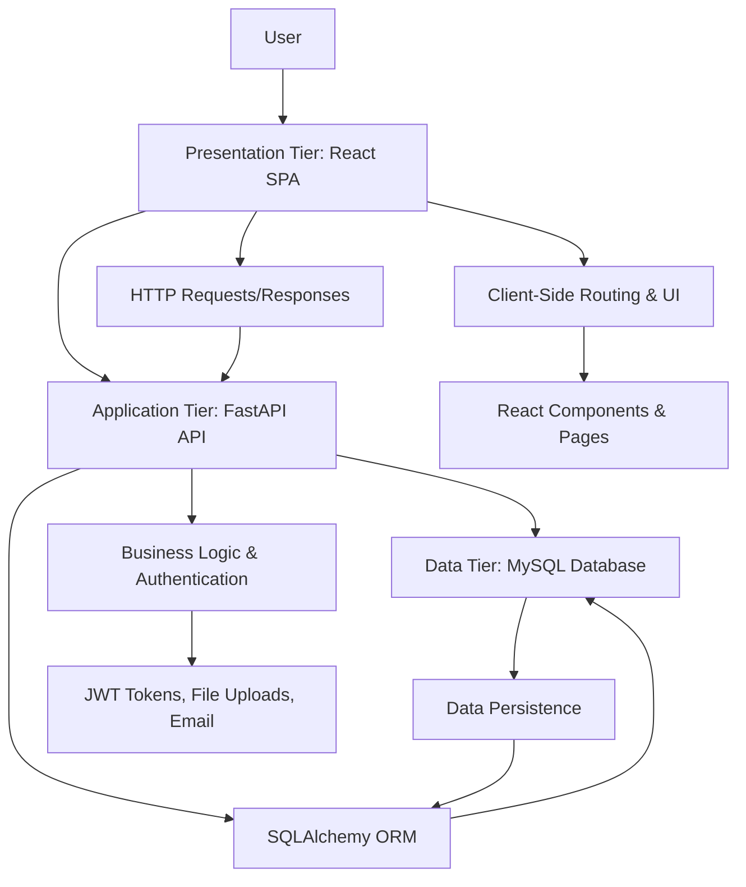
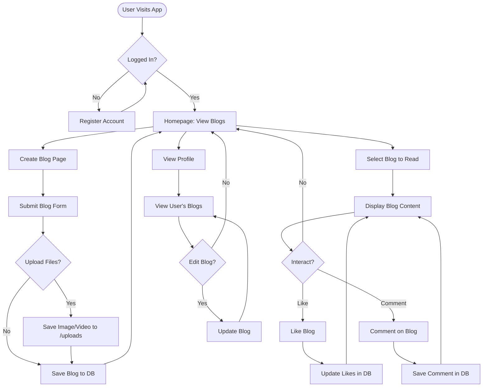
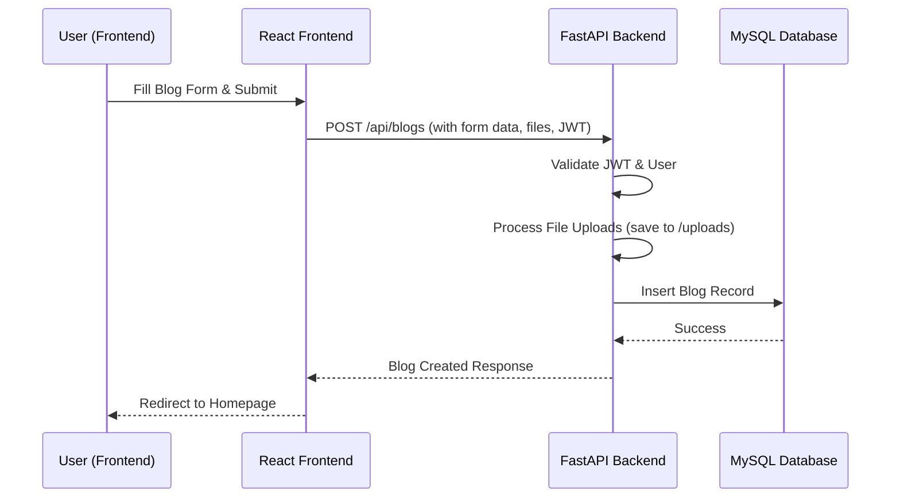

# Technical Flowchart: Blog Management App

Below are Mermaid diagrams representing the technical flowcharts for the Blog Management App.

## 1. System Architecture Flowchart (Three-Tier Architecture)

### Explanation:
- **User**: Interacts with the frontend.
- **Presentation Tier**: React app handles UI, sends API calls to backend.
- **Application Tier**: FastAPI processes requests, validates data, handles auth, interacts with DB via ORM.
- **Data Tier**: MySQL stores data; accessed via SQLAlchemy.

## 2. User Interaction Flowchart (Blog Creation & Viewing)

### Explanation:
- Illustrates a typical user journey: registration/login, browsing blogs, creating/editing blogs, interacting with likes/comments.
- Highlights key actions and data flows (e.g., file uploads, DB saves).

## 3. API Request Flowchart (Example: Creating a Blog)

### Explanation:
- Sequence diagram for a specific API interaction, showing request flow from frontend to backend to DB.

To render these diagrams, use a Mermaid-compatible viewer (e.g., GitHub, Mermaid Live Editor, or VSCode extension).
